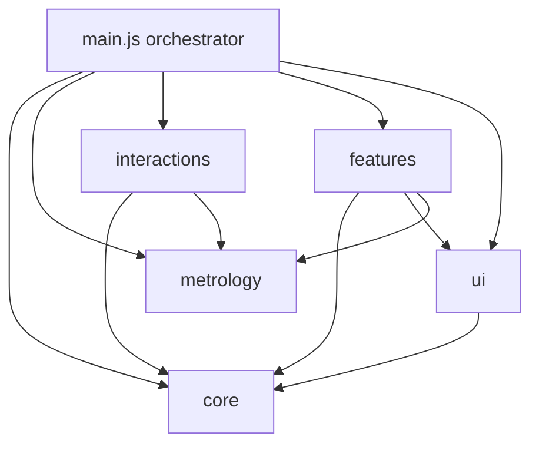

# REFACTOR_PLAN.md — Staged Refactor Plan

**TWENTY EIGHT**

This document is **completed historical refactor documentation** — a planning-only record of the staged maintainability refactor (Phases 0–9). It does not implement any refactor by itself and is **not** an active source of truth for new feature work.

**Active sources of truth (for future implementation prompts):**
- [PROJECT_CONTEXT.md](PROJECT_CONTEXT.md) — behavioral contract (scale, interactions, UI, do-not-break rules)
- [PROJECT_STRUCTURE.md](PROJECT_STRUCTURE.md) — current file layout and `main.js` / `style.css` breakdown

This file remains useful as a phase-by-phase audit trail and regression checklist reference only.

**Current state (after Phase 9 — refactor complete):**
- [src/main.js](src/main.js) — ~64 lines; thin orchestrator (imports, scene assembly, `setupPointInteraction`, animation loop); sole JS entry via [index.html](index.html)
- [src/style.css](src/style.css) — `@import` entry only; styles split under [src/styles/](src/styles/) (Phase 8)
- [src/core/](src/core/) — `constants.js`, `formatters.js`, `math.js`, `scene.js` (Phases 1, 3)
- [src/ui/](src/ui/) — `domRefs.js`, `hoverTooltip.js`, `selectionPanel.js`, `measurementPanel.js`, `annotationPanel.js` (Phases 2, 6, 7)
- [src/metrology/](src/metrology/) — `roomShell.js`, `volumeGrid.js`, `axes.js`, `referenceMarkers.js` (Phase 4)
- [src/features/](src/features/) — `selection.js` (Phase 5), `measurement.js` (Phase 6), `annotations.js` (Phase 7)
- [src/interactions/](src/interactions/) — `hover.js` (Phase 5), `raycast.js`, `picking.js`, `pointerEvents.js` (Phase 9)
- [src/styles/](src/styles/) — `variables.css`, `layout.css`, `components.css`, `overlays.css` (Phase 8)

**All phases (0–9) complete.** The staged refactor is finished; runtime behavior is unchanged.

**Hard constraints for every phase:**
- Preserve runtime behavior exactly
- One small refactor step at a time
- Run regression checks after every step
- Avoid large rewrites
- Keep Vite + Three.js + vanilla ES modules
- Do not introduce React or a new framework
- Do not move files outside the phase scope
- Do not change `index.html` script entry until explicitly noted (Phase 8 keeps the same CSS link)

---

## Phase Status Tracker

| Phase | Name | Status | Notes |
|-------|------|--------|-------|
| 0 | Baseline snapshot and regression checklist | **Complete** | This document created |
| 1 | Extract constants and formatting helpers | **Complete** | Extracted to `src/core/constants.js`, `formatters.js`, `math.js`; `npm run build` passed |
| 2 | Extract DOM references and UI helpers | **Complete** | Extracted to `src/ui/domRefs.js`, `hoverTooltip.js`, `selectionPanel.js`; `npm run build` passed; manual browser spot check passed |
| 3 | Extract scene / camera / renderers / controls | **Complete** | Extracted to `src/core/scene.js`; `npm run build` passed; manual browser checks passed |
| 4 | Extract room shell, grid, axes, LOD lattice | **Complete** | Extracted to `src/metrology/`; `npm run build` passed; manual browser checks passed |
| 5 | Extract selection and hover tooltip logic | **Complete** | Extracted to `src/features/selection.js`, `src/interactions/hover.js`; `npm run build` passed; manual browser checks passed (hover highlight, hover coordinate tooltip, no hover while orbiting, point selection, Clear Selection, A/B measurement, Origin/Center hover labels) |
| 6 | Extract measurement module | **Complete** | Extracted to `src/features/measurement.js`, `src/ui/measurementPanel.js`; `npm run build` passed; manual browser checks passed (Point A/B flow, third click starts new measurement, Clear Point A, Clear Point B, Clear Measurement, Clear History, floating distance label, measurement history) |
| 7 | Extract annotation module | **Complete** | Extracted to `src/features/annotations.js`, `src/ui/annotationPanel.js`; `npm run build` passed; manual browser checks passed (Add Annotation, 3D-anchored annotation labels, orbit/zoom/pan stability, multiple annotations, Delete annotation, hover/selection/measurement still working) |
| 8 | Split CSS into layout / components / overlays | **Complete** | Split into `src/styles/`; `src/style.css` is `@import` chain only; `npm run build` passed; manual browser checks passed (header, sidebars, viewport/canvas size, inspector panels, buttons, hover tooltip, CSS2D labels, history/annotation scroll lists, bottom status bar) |
| 9 | Final cleanup and documentation update | **Complete** | Extracted final interaction/picking modules into `src/interactions/raycast.js`, `picking.js`, `pointerEvents.js`; `main.js` thinned to ~64-line orchestrator; `npm run build` passed; manual full browser regression passed (hover highlight, hover coordinate tooltip, point selection, Clear Selection, Point A/B measurement flow, Clear Point A, Clear Point B, Clear Measurement, floating distance label, measurement history, Clear History, Add Annotation, Delete Annotation, 3D-anchored annotation labels, Origin/Center hover labels, TWENTY EIGHT UI layout) |

---

## 1. Refactor Principles

These rules apply to **every** phase. If a step violates one, stop and redesign the step.

| Principle | What it means in practice |
|-----------|---------------------------|
| **Preserve behavior exactly** | No changes to scale rules, LOD math, pick logic, click flows, or UI semantics. Diffs should be import/export moves and wiring changes only. |
| **One small step at a time** | Each phase touches one concern. `src/main.js` remains the Vite entry point until Phase 9 thins it to orchestration. |
| **Regression after every step** | Run the full [Do-Not-Break Checklist](#6-do-not-break-checklist) (or the phase-specific subset) manually. `npm run dev` and `npm run build` must succeed. |
| **Avoid large rewrites** | Copy-move-extract, not redesign. Keep function bodies identical on first extraction; refactor internals only in later optional passes. |
| **Keep the stack** | ES module `import` / `export`. Vite resolves paths with no config change until a phase explicitly needs it. |
| **No new frameworks** | DOM manipulation and Three.js only. No React, Vue, state libraries, or CSS preprocessors. |

### Phase acceptance gate

A phase is **complete** only when:

1. The phase regression checklist passes
2. `npm run build` succeeds
3. Documentation is updated per the [Documentation Update Policy](#8-documentation-update-policy)
4. This file's phase status table is updated

---

## 2. Target Folder Structure

End-state layout under `src/`. Folders are created **gradually** per migration phases — not all at once.

```
src/
├── main.js                 # Thin orchestrator (entry point; shrinks over phases)
├── core/
│   ├── constants.js        # ROOM_SIZE, LOD_*, GRID_UNIT, INTERNAL_*, LABEL_STEP, HOVER_TOOLTIP_OFFSET
│   ├── formatters.js       # formatCoordinate, formatPointCoords, formatDistance, formatAnnotationCoords
│   ├── math.js             # smoothstep, calculateDistance
│   └── scene.js            # Scene, camera, renderers, controls, syncRendererSize, resize (Phase 3)
├── metrology/
│   ├── roomShell.js        # createRoomShell, createGridMarkers
│   ├── volumeGrid.js       # Lattice generation, LOD layers, updateInternalVolumeLod
│   ├── axes.js             # createAxisLine, createAxisLabel, createAxes
│   └── referenceMarkers.js # Origin/Center markers and hover labels
├── interactions/
│   ├── raycast.js          # Raycaster temps, resolveVolumePoint, findNearestSamplePoint
│   ├── picking.js          # pickVolumePoint, isSamePoint, isMeasurementPoint
│   ├── hover.js            # Hover highlight, processHoverUpdate, scheduleHoverUpdate
│   └── pointerEvents.js    # setupPointInteraction, updateMouseFromEvent, drag flags
├── features/
│   ├── selection.js        # selectedPoint state, selectPoint, clearSelection
│   ├── measurement.js      # A/B flow, line, floating label, history state
│   └── annotations.js      # CRUD, THREE.Group visuals, disposal, annotationsGroup
├── ui/
│   ├── domRefs.js          # Cached getElementById references
│   ├── selectionPanel.js   # updateSelectionPanel
│   ├── measurementPanel.js # updateMeasurementPanel, renderMeasurementHistory
│   ├── annotationPanel.js  # renderAnnotationList
│   └── hoverTooltip.js     # Screen-space hover coordinate tooltip
├── styles/
│   ├── variables.css       # :root design tokens
│   ├── layout.css          # App grid, header, sidebars, viewport, footer
│   ├── components.css      # Inspector, buttons, history, annotations sidebar
│   └── overlays.css        # Hover tooltip, CSS2D label classes
└── style.css               # @import chain only (Phase 8; preserves index.html link)
```

### Folder ownership

| Folder | Owns | Must NOT own |
|--------|------|--------------|
| `core/` | Scale constants, pure formatters, shared math, scene/camera/renderer bootstrap | Feature session state, event listeners, sidebar DOM updates |
| `metrology/` | Static scene geometry: room shell, surface grid, internal lattice, axes, LOD layers, Origin/Center markers | Click/hover handlers, measurement advance logic, panel updates |
| `interactions/` | Pointer pipeline, raycasting, hover scheduling, volume pick entry points | Feature business rules (e.g. when to advance measurement) |
| `features/` | Session state and feature logic: selection, measurement, annotations | Low-level renderer initialization |
| `ui/` | DOM queries, panel visibility, list rendering, screen-space hover tooltip | Three.js mesh creation (CSS2D element factories may remain in `features/` initially) |
| `styles/` | Presentation only | Any JavaScript |

### Module dependency direction



**Rule:** `core/` must not import from `features/`, `interactions/`, or `metrology/`. `ui/` must not import Three.js scene objects except where unavoidable (defer such coupling to `main.js` wiring).

---

## 3. Migration Phases

Each phase below follows the same template: goal, files, moves, constraints, regression, risk.

---

### Phase 0 — Baseline snapshot and regression checklist

**Status:** Complete (this document)

#### Goal

Establish a reproducible manual regression baseline before any code extraction. Capture what works today so every later phase can be validated against it.

#### Files to create

- `REFACTOR_PLAN.md` (this file)

#### Files to modify

- None (app code unchanged)

#### What code moves

Nothing.

#### What must not change

The entire application — all metrology behavior, UI layout, and build pipeline.

#### Baseline snapshot notes

| Item | Value |
|------|-------|
| `src/main.js` line count | ~1,166 |
| `src/style.css` line count | ~679 |
| JS entry | `<script type="module" src="/src/main.js">` in `index.html` |
| CSS entry | `<link rel="stylesheet" href="/src/style.css">` in `index.html` |
| Run dev | `npm run dev` |
| Run build | `npm run build` |

Record browser, viewport size, and dev server URL when running manual regression (recommended: desktop Chrome, full window).

#### Regression checklist (Phase 0)

- [ ] `npm run dev` starts without errors
- [ ] `npm run build` completes without errors
- [ ] Full [Do-Not-Break Checklist](#7-do-not-break-checklist) documented and understood

#### Risk level

**Low**

---

### Phase 1 — Extract constants and formatting helpers

**Status:** Complete

**Completed note:** Extracted constants, formatters, and pure math helpers into:
- `src/core/constants.js`
- `src/core/formatters.js`
- `src/core/math.js`

`npm run build` passed after extraction. Behavior unchanged — import-only refactor in `main.js`.

#### Goal

First zero-behavior-change extractions: pure data and pure functions with no side effects. Validates the module import path without touching Three.js or DOM logic.

#### Files to create

| File | Exports |
|------|---------|
| `src/core/constants.js` | `ROOM_SIZE`, `GRID_UNIT`, `INTERNAL_SAMPLE_UNIT`, `INTERNAL_POINT_COUNT`, `INTERNAL_LOD_COARSE`, `INTERNAL_LOD_MEDIUM`, `LOD_FAR`, `LOD_MID`, `LOD_NEAR`, `LABEL_STEP`, `HOVER_TOOLTIP_OFFSET` |
| `src/core/formatters.js` | `formatCoordinate`, `formatPointCoords`, `formatAnnotationCoords`, `formatDistance` |
| `src/core/math.js` | `smoothstep`, `calculateDistance` |

#### Files to modify

- `src/main.js` — remove inline definitions; add `import` statements

#### What code moves

From `src/main.js` (see [PROJECT_STRUCTURE.md](PROJECT_STRUCTURE.md) §3):

| Source lines (approx.) | Destination | Symbols |
|------------------------|-------------|---------|
| 5–15 | `core/constants.js` | All scale and LOD constants |
| 490–498, 638–640 | `core/formatters.js` | `formatCoordinate`, `formatPointCoords`, `formatAnnotationCoords`, `formatDistance` |
| 207–210, 631–636 | `core/math.js` | `smoothstep`, `calculateDistance` |

#### What must not change

- Constant **values** (e.g. `ROOM_SIZE = 200`, `LOD_FAR = 420`)
- Formatter output strings and rounding (coordinates as integers; distance to 2 decimal places)
- `calculateDistance` Euclidean formula and result in centimeters
- `smoothstep` edge behavior used by LOD blending

#### Regression checklist

- [ ] App loads without console errors
- [ ] Header badge still shows **68,921 POINTS**
- [ ] Selected Point coordinates display as integer cm values
- [ ] Measurement distance displays to 2 decimal places (e.g. `11.18 cm`)
- [ ] LOD blending still smooth when zooming (uses `smoothstep` + constants)
- [ ] `npm run build` succeeds

#### Risk level

**Low**

---

### Phase 2 — Extract DOM references and UI helpers

**Status:** Complete

**Completed note:** Extracted DOM references and early UI helpers into:
- `src/ui/domRefs.js`
- `src/ui/hoverTooltip.js`
- `src/ui/selectionPanel.js`

`npm run build` passed after extraction. Manual browser spot check passed for: hover tooltip, tooltip viewport flip, selected point panel, Clear Selection, and A/B measurement still working. Behavior unchanged — import-only refactor in `main.js`.

#### Goal

Isolate HTML/DOM coupling from Three.js logic. Create a single import surface for cached element references and early UI update helpers.

#### Files to create

| File | Contents |
|------|----------|
| `src/ui/domRefs.js` | All `document.getElementById` cache (current L17–38) |
| `src/ui/hoverTooltip.js` | `hideHoverCoordinateTooltip`, `updateHoverCoordinateTooltip` |
| `src/ui/selectionPanel.js` | `updateSelectionPanel` |

#### Files to modify

- `src/main.js` — import from `ui/` modules; remove moved code

#### What code moves

| Source lines (approx.) | Destination | Symbols |
|------------------------|-------------|---------|
| 17–38 | `ui/domRefs.js` | `container`, `viewportEl`, `hoverTooltipEl`, panel elements, buttons, list containers |
| 324–366 | `ui/hoverTooltip.js` | `hideHoverCoordinateTooltip`, `updateHoverCoordinateTooltip` |
| 844–849 | `ui/selectionPanel.js` | `updateSelectionPanel` |

`hoverTooltip.js` will import `HOVER_TOOLTIP_OFFSET` from `core/constants.js` and DOM refs from `domRefs.js`.

#### What must not change

- Element IDs in `index.html` (e.g. `#hover-coordinate-tooltip`, `#selection-panel`)
- Tooltip cursor offset (`HOVER_TOOLTIP_OFFSET = 18`)
- Tooltip viewport flip behavior (left/up when overflowing)
- Panel show/hide timing (`selectionPanel.classList.remove('hidden')` on select)
- `pointer-events: none` on tooltip (CSS unchanged in this phase)

#### Regression checklist

- [ ] Hover coordinate tooltip follows cursor with offset
- [ ] Tooltip flips when near viewport edge
- [ ] Tooltip shows `X/Y/Z` as integer cm values
- [ ] Tooltip hides on canvas leave and during orbit drag
- [ ] Clicking a point shows Selected Point panel with correct coordinates
- [ ] Clear Selection hides panel and clears highlight (measurement unaffected)
- [ ] `npm run build` succeeds

#### Risk level

**Low**

---

### Phase 3 — Extract scene / camera / renderers / controls

**Status:** Complete

**Completed note:** Extracted scene, camera, renderers, OrbitControls, `syncRendererSize`, and resize handling into:
- `src/core/scene.js`

`npm run build` passed after extraction. Manual browser checks passed for: scene load, OrbitControls, CSS2D labels, resize behavior, and hover/selection/measurement/annotation sanity checks. Behavior unchanged — import-only refactor in `main.js`.

#### Goal

Isolate rendering infrastructure shared by all features: scene graph root, camera, WebGL renderer, CSS2D renderer, OrbitControls, and resize sync.

#### Files to create

| File | Contents |
|------|----------|
| `src/core/scene.js` | Scene, fog, lights, camera, renderers, `syncRendererSize`, OrbitControls init, `createResizeHandler` or `onResize` export |

Suggested factory pattern (behavior-identical to today):

```js
// Illustrative — implement by moving existing code verbatim
export function initScene() { /* scene, fog, lights */ }
export function initRenderers(container) { /* WebGL + CSS2D, syncRendererSize */ }
export function initControls(camera, domElement) { /* OrbitControls */ }
```

#### Files to modify

- `src/main.js` — call factories; hold returned refs (`scene`, `camera`, `renderer`, `labelRenderer`, `controls`)

#### What code moves

| Source lines (approx.) | Destination | Symbols |
|------------------------|-------------|---------|
| 64–109 | `core/scene.js` | `scene`, background, fog, ambient + directional lights |
| 68–96 | `core/scene.js` | `camera`, `renderer`, `labelRenderer`, `syncRendererSize` |
| 98–104 | `core/scene.js` | `controls` (OrbitControls) |
| 1149–1153 | `core/scene.js` | `onResize` → `syncRendererSize` |

#### What must not change

- Camera position `(320, 260, 320)` and FOV `45`
- Controls target `(100, 100, 100)` — cube center
- `enableDamping`, `dampingFactor = 0.08`
- `minDistance = 120`, `maxDistance = 800`
- CSS2D renderer DOM: `position: absolute`, `pointer-events: none`
- `syncRendererSize` guards (`width <= 0 || height <= 0` early return)
- Renderer sizing tied to `#canvas-container` client dimensions
- `setPixelRatio(Math.min(window.devicePixelRatio, 2))`

#### Regression checklist

- [ ] Canvas fills center viewport
- [ ] Axis tick labels (CSS2D) render and face camera
- [ ] Measurement floating distance label (CSS2D) renders at line midpoint
- [ ] Window resize does not clip or misalign CSS2D labels
- [ ] Orbit (left drag), pan (right drag), zoom (scroll) behave as before
- [ ] Reference marker and annotation CSS2D labels render correctly
- [ ] `npm run build` succeeds

#### Risk level

**Medium** — CSS2DRenderer sizing must stay synchronized with WebGL renderer

---

### Phase 4 — Extract room shell, grid, axes, LOD lattice

**Status:** Complete

**Completed note:** Extracted metrology geometry modules into:
- `src/metrology/roomShell.js`
- `src/metrology/volumeGrid.js`
- `src/metrology/axes.js`
- `src/metrology/referenceMarkers.js`

`npm run build` passed after extraction. Manual browser checks passed for: cube shell, surface grid, internal lattice / LOD, axes and tick labels, Origin / Center hover labels, and point picking and measurement sanity. Behavior unchanged — import-only refactor in `main.js`.

#### Goal

Move static metrology geometry generation out of `main.js`: room boundaries, surface grid, internal volume lattice with LOD layers, axes, and Origin/Center reference markers.

#### Files to create

| File | Contents |
|------|----------|
| `src/metrology/roomShell.js` | `createRoomShell`, `createGridMarkers` |
| `src/metrology/volumeGrid.js` | `collectLodPoints`, `buildAllSamplePositions`, `createLodLayer`, `createInternalVolumeGrid`, `updateInternalVolumeLod` |
| `src/metrology/axes.js` | `createAxisLine`, `createAxisLabel`, `createAxes` |
| `src/metrology/referenceMarkers.js` | `createReferenceMarker`, `createReferenceMarkers`, `hideReferenceMarkerLabels`, `updateReferenceMarkerHover` |

#### Files to modify

- `src/main.js` — import factories; keep `scene.add(...)` assembly block until Phase 9

#### What code moves

| Source lines (approx.) | Destination | Symbols |
|------------------------|-------------|---------|
| 111–205 | `metrology/roomShell.js` | `createRoomShell`, `createGridMarkers` |
| 212–292, 1062–1071 | `metrology/volumeGrid.js` | Lattice generation, LOD layers, `updateInternalVolumeLod` |
| 1073–1127 | `metrology/axes.js` | `createAxisLine`, `createAxisLabel`, `createAxes` |
| 383–456 | `metrology/referenceMarkers.js` | Reference marker factories and hover label helpers |

`volumeGrid.js` imports `smoothstep` from `core/math.js` and constants from `core/constants.js`.

#### What must not change

- Cube dimensions: **200 × 200 × 200 cm**
- Surface grid: **10 cm** spacing on all six faces
- Internal sampling: **5 cm**, **41³ = 68,921** points
- Three LOD layers: coarse (20 cm), medium (10 cm, excluding 20 cm), fine (5 cm, excluding 10 cm)
- `volumeGrid.userData.pickMeshes` — pick isolation contract for raycasting
- LOD thresholds: `LOD_FAR = 420`, `LOD_MID = 280`, `LOD_NEAR = 190`
- Axis labels every **20 cm** on X (red), Y (green), Z (blue)
- Origin marker at `(0, 0, 0)`, Center marker at `(100, 100, 100)`
- Reference labels: hover-only, CSS2D, no connecting lines
- **No reference planes** reintroduced

#### Regression checklist

- [ ] Transparent cube shell and wireframe edges visible
- [ ] 10 cm surface grid markers on all faces
- [ ] Internal lattice visible; density changes smoothly when zooming (LOD)
- [ ] At far zoom: mostly coarse (20 cm) points dominate
- [ ] At close zoom: fine (5 cm) lattice most visible
- [ ] RGB axes with tick labels at 0, 20, 40, … 200
- [ ] Origin hover shows `Origin (0, 0, 0)`; Center hover shows `Center (100, 100, 100)`
- [ ] Point picking still works (raycast uses `pickMeshes` only)
- [ ] Annotations and reference markers are **not** in volume pick meshes
- [ ] `npm run build` succeeds

#### Risk level

**Medium** — LOD layer generation and `pickMeshes` contract

---

### Phase 5 — Extract selection and hover logic

**Status:** Complete

Extracted selection and hover logic into:
- `src/features/selection.js`
- `src/interactions/hover.js`

`npm run build` passed. Manual browser checks passed for: hover highlight, hover coordinate tooltip, no hover while orbiting, point selection, Clear Selection, A/B measurement still working, Origin/Center hover labels.

#### Goal

Separate interaction visuals and the hover pipeline from click/measurement flow. Selection state and hover scheduling move out of the monolith; `pickVolumePoint` stays in `main.js` until Phase 6/9.

#### Files to create

| File | Contents |
|------|----------|
| `src/features/selection.js` | `createSelectionHighlight`, `selectedPoint` state, `selectPoint`, `clearSelection` |
| `src/interactions/hover.js` | `createHoverHighlight`, `updateHoverPoint`, `processHoverUpdate`, `scheduleHoverUpdate`, hover drag/frame flags |

#### Files to modify

- `src/main.js` — import selection and hover modules; pass deps into hover/click handlers

#### What code moves

| Source lines (approx.) | Destination | Symbols |
|------------------------|-------------|---------|
| 294–302 | `features/selection.js` | `createSelectionHighlight` |
| 59, 851–865 | `features/selection.js` | `selectedPoint`, `selectPoint`, `clearSelection` |
| 309–322 | `interactions/hover.js` | `createHoverHighlight` |
| 56–62, 895–933 | `interactions/hover.js` | Pointer drag flags, `hoverFramePending`, `updateHoverPoint`, `processHoverUpdate`, `scheduleHoverUpdate` |

`processHoverUpdate` continues to call `updateHoverCoordinateTooltip` (from `ui/hoverTooltip.js`) and `updateReferenceMarkerHover` (from `metrology/referenceMarkers.js`).

#### What must not change

- Hover highlight: soft blue cube, smaller than selection
- Hover hidden while `isPointerDragging` (orbit drag)
- Hover hidden when pointer leaves canvas
- Hover suppressed on selected point and measurement points A/B
- Hover updates throttled via `requestAnimationFrame`
- Selection highlight: bright cyan cube; single selection only
- Blue vs cyan visual distinction

#### Regression checklist

- [x] Hover highlight appears on volumetric points
- [x] Hover coordinate tooltip syncs with hovered point
- [x] No hover highlight or tooltip during orbit drag
- [x] No hover on selected point or A/B markers
- [x] Click selects point; cyan highlight and Selected Point panel update
- [x] Clear Selection works; does not clear A/B or measurement line
- [x] Origin/Center hover labels still work alongside volume hover
- [x] `npm run build` succeeds

#### Risk level

**Medium–High** — hover pipeline touches tooltip, reference markers, and volume pick in one path

---

### Phase 6 — Extract measurement module

**Status:** Complete

Extracted measurement logic into:
- `src/features/measurement.js`
- `src/ui/measurementPanel.js`

`npm run build` passed. Manual browser checks passed for: Point A / Point B flow, third click starts new measurement, Clear Point A, Clear Point B, Clear Measurement, Clear History, floating distance label, measurement history.

#### Goal

Encapsulate two-point distance measurement end-to-end: state, visuals, panel updates, history, and all clear/advance logic.

#### Files to create

| File | Contents |
|------|----------|
| `src/features/measurement.js` | `createMeasurementMarker`, `createMeasurementLine`, `createMeasurementState`, set/clear/advance functions, `addMeasurementToHistory`, `clearMeasurementHistory` |
| `src/ui/measurementPanel.js` | `updateMeasurementPanel`, `renderMeasurementHistory` |

#### Files to modify

- `src/main.js` — import measurement module; wire `pickVolumePoint` to call exported functions
- Optionally begin `src/interactions/picking.js` if `pickVolumePoint` is extracted here (full extraction deferred to Phase 9 if safer)

#### What code moves

| Source lines (approx.) | Destination | Symbols |
|------------------------|-------------|---------|
| 368–488 | `features/measurement.js` | `createMeasurementMarker`, `createMeasurementLine`, `createMeasurementState` |
| 40–41, 631–842 | `features/measurement.js` + `ui/measurementPanel.js` | `measurementHistory`, `measurementCounter`, all measurement logic, panel/history rendering |

Key functions: `calculateDistance` already in `core/math.js`; `formatDistance` in `core/formatters.js`.

Measurement click flow (must remain identical):

1. First click → Point A (orange)
2. Second click → Point B (magenta), line + distance
3. Third click (A and B set) → new Point A, clears B and line

Each click also updates Selected Point panel and selection highlight.

#### What must not change

- Euclidean distance in cm (1 unit = 1 cm)
- Line color `#b8dcf0` — thin, not glowing
- Floating CSS2D distance label at line midpoint
- Point A orange, Point B magenta — distinct from hover/selection
- **Clear Point A** — removes A only; keeps B; removes line/label; keeps history
- **Clear Point B** — removes B only; keeps A; removes line/label; keeps history
- **Clear Measurement** — removes A, B, line, label; keeps history
- **Clear Selection** — separate; does not affect measurement
- History: newest first, unlimited session storage, scrollable list
- **Clear History** — removes all history entries

#### Regression checklist

- [x] First click sets Point A (orange marker)
- [x] Second click sets Point B, draws line, shows distance label
- [x] Third click starts new measurement (new A, B cleared)
- [x] Each click updates Selected Point panel
- [x] Clear Point A / Clear Point B / Clear Measurement — distinct behavior verified
- [x] Floating distance label at midpoint, faces camera
- [x] Completed measurement added to history (newest first)
- [x] History list scrolls when long; Clear History empties list
- [x] Clearing active measurement does not clear history
- [x] `npm run build` succeeds

#### Risk level

**High** — `pickVolumePoint` calls `selectPoint` and `advanceMeasurement` together; `advanceMeasurement` third-click semantics

---

### Phase 7 — Extract annotation module

**Status:** Complete

Extracted annotation logic into:
- `src/features/annotations.js`
- `src/ui/annotationPanel.js`

`npm run build` passed. Manual browser checks passed for: Add Annotation, 3D-anchored annotation labels, orbit / zoom / pan stability, multiple annotations, Delete annotation, hover / selection / measurement still working.

#### Goal

Isolate annotation CRUD, THREE.Group visuals, CSS2D anchored labels, disposal helpers, and sidebar list rendering.

#### Files to create

| File | Contents |
|------|----------|
| `src/features/annotations.js` | `createAnnotationVisual`, `addAnnotation`, `deleteAnnotation`, `tryAddAnnotationFromSelection`, disposal helpers, `annotationsGroup`, state |
| `src/ui/annotationPanel.js` | `renderAnnotationList` |

#### Files to modify

- `src/main.js` — import annotation module; wire Add Annotation button and `annotationsGroup` into scene

#### What code moves

| Source lines (approx.) | Destination | Symbols |
|------------------------|-------------|---------|
| 42–45, 502–629 | `features/annotations.js` + `ui/annotationPanel.js` | `annotations`, `annotationIdCounter`, `annotationsGroup`, visual factory, CRUD, disposal, list render |

#### What must not change

- Annotations are session-only (in-memory)
- Each annotation: `THREE.Group` at `group.position.set(x, y, z)` — positioned once
- Group contains purple box marker + `CSS2DObject` label offset `(0, 6, 0)`
- Labels anchored to 3D coordinate — **do not follow mouse**
- Labels rendered every frame via existing `CSS2DRenderer`
- Labels use `pointer-events: none`
- Groups not recreated or moved during hover, orbit, or camera movement
- Add blocked while OrbitControls dragging
- Annotation groups **not** in volume `pickMeshes`
- Delete removes correct marker, label DOM node, and list entry

#### Regression checklist

- [x] Select point → enter name → Add Annotation creates 3D marker + label
- [x] Label stays at 3D position when orbiting/zooming
- [x] Annotation list appears in left inspector with name and coords
- [x] Delete removes marker, label, and list entry
- [x] Annotations do not interfere with hover, selection, measurement, or reference markers
- [x] Cannot add annotation while dragging to orbit
- [x] `npm run build` succeeds

#### Risk level

**High** — CSS2D DOM cleanup, scene graph disposal, separation from pick meshes

---

### Phase 8 — Split CSS into layout / components / overlays

**Status:** Complete

Split CSS into:
- `src/styles/variables.css`
- `src/styles/layout.css`
- `src/styles/components.css`
- `src/styles/overlays.css`

`src/style.css` is now an `@import` chain only. `npm run build` passed. Manual browser checks passed for: header, sidebars, viewport/canvas size, inspector panels, buttons, hover tooltip, CSS2D labels, history/annotation scroll lists, bottom status bar.

#### Goal

Mirror JS modularization in styles without changing computed layout or visual appearance.

#### Files to create

| File | Source section (style.css lines approx.) | Contents |
|------|------------------------------------------|----------|
| `src/styles/variables.css` | 1–54 | `:root` tokens, reset, `html`/`body`, cosmic background |
| `src/styles/layout.css` | 56–221 | `#app-layout`, header, sidebars |
| `src/styles/components.css` | 223–530 | Inspector sections, history, annotations, buttons, agent tools |
| `src/styles/overlays.css` | 532–679 | Viewport, canvas, hover tooltip, status bar, CSS2D label classes |

#### Files to modify

- `src/style.css` — replace body with `@import` chain only:

```css
@import './styles/variables.css';
@import './styles/layout.css';
@import './styles/components.css';
@import './styles/overlays.css';
```

- **Do not** change `index.html` stylesheet link (`/src/style.css` remains the entry)

#### What code moves

Pure CSS cut/paste by comment-delimited sections per [PROJECT_STRUCTURE.md](PROJECT_STRUCTURE.md) §4. No rule changes, no selector renames, no property value edits.

#### What must not change

- TWENTY EIGHT CSS grid layout (`#app-layout` five regions)
- Glassmorphism palette and typography (Syne, JetBrains Mono)
- Scroll caps: `max-height: min(320px, 38vh)` on history and annotation lists
- `pointer-events: none` on chrome; interactive exceptions on buttons and scrollable lists
- `#hover-coordinate-tooltip` screen-space overlay styling
- CSS2D classes: `.axis-label`, `.measurement-distance-label`, `.ref-marker-label`, `.annotation-marker-label`

#### Regression checklist

- [x] Visual comparison: header, left sidebar, viewport, right sidebar, status bar unchanged
- [x] Inspector sections, buttons, and badges look identical
- [x] Hover tooltip styling and positioning unchanged
- [x] CSS2D labels (axes, measurement, references, annotations) styled correctly
- [x] History and annotation list scroll behavior unchanged
- [x] `npm run build` succeeds; production CSS bundle includes all imports

#### Risk level

**Low–Medium** — CSS `@import` order must preserve cascade (variables → layout → components → overlays)

---

### Phase 9 — Final cleanup and documentation update

**Status:** Complete

Extracted final interaction/picking modules into:
- `src/interactions/raycast.js`
- `src/interactions/picking.js`
- `src/interactions/pointerEvents.js`

`main.js` thinned to a ~64-line orchestrator. `npm run build` passed. Manual full browser regression passed for: hover highlight, hover coordinate tooltip, point selection, Clear Selection, Point A/B measurement flow, Clear Point A, Clear Point B, Clear Measurement, floating distance label, measurement history, Clear History, Add Annotation, Delete Annotation, 3D-anchored annotation labels, Origin/Center hover labels, TWENTY EIGHT UI layout.

#### Goal

Thin `main.js` to orchestration only: imports, scene assembly, interaction setup, animation loop. Extract remaining interaction modules. Update all documentation.

#### Files to create

| File | Contents |
|------|----------|
| `src/interactions/raycast.js` | `raycaster`, vector temps, `resolveVolumePoint`, `findNearestSamplePoint`, `getPositionFromInstanceHit` |
| `src/interactions/picking.js` | `pickVolumePoint`, `isSamePoint`, `isMeasurementPoint` |
| `src/interactions/pointerEvents.js` | `setupPointInteraction`, `updateMouseFromEvent` |

(If any of these were created during Phase 5–6, merge rather than duplicate.)

#### Files to modify

- `src/main.js` — wiring only (target: roughly imports + `scene.add(...)` + `setupPointInteraction(...)` + `animate()` + resize listener)
- [PROJECT_CONTEXT.md](PROJECT_CONTEXT.md) — Key Source Files table and any ownership notes
- [PROJECT_STRUCTURE.md](PROJECT_STRUCTURE.md) — full file tree, feature ownership map
- `REFACTOR_PLAN.md` — mark all phases complete; note deviations

#### What code moves

| Source lines (approx.) | Destination | Symbols |
|------------------------|-------------|---------|
| 47–54, 867–891, 935–973 | `interactions/raycast.js` | Raycaster setup and volume point resolution |
| 891–894, 975–984 | `interactions/picking.js` | `pickVolumePoint`, point comparison helpers |
| 867–871, 986–1060 | `interactions/pointerEvents.js` | `updateMouseFromEvent`, `setupPointInteraction` |
| 1155–1166 | stays in `main.js` | `animate` loop (or `core/scene.js` export `startAnimationLoop` if preferred) |

#### Target `main.js` responsibilities

1. Import from `core/`, `metrology/`, `interactions/`, `features/`, `ui/`
2. Initialize scene, renderers, controls
3. Create and `scene.add(...)` all objects
4. Call `setupPointInteraction(...)` with explicit dependencies
5. Register resize listener
6. Start `animate()` loop

#### What must not change

- **Initialization order:** constants/DOM → scene/camera/renderers → controls → geometry factories → scene assembly → interaction setup → animate
- **Animation loop order:** `controls.update()` → `updateInternalVolumeLod(...)` → `renderer.render(...)` → `labelRenderer.render(...)`
- `allSamplePositions` populated before interaction setup (used by `findNearestSamplePoint`)
- Entry point remains `src/main.js` for Vite

#### Regression checklist

- [x] Full [Do-Not-Break Checklist](#6-do-not-break-checklist) — every item
- [x] `main.js` is substantially smaller and readable as orchestrator (~64 lines)
- [x] No circular import errors at dev or build time
- [x] `npm run build` succeeds
- [x] Documentation updated per policy below

#### Risk level

**Medium** — init order and explicit dependency wiring across modules

---

## 4. Low-Risk First Moves

Recommended extraction order for Phases 1–2 (do these before touching interaction or scene code):

| Priority | Item | Location today | Why low risk |
|----------|------|----------------|--------------|
| 1 | **Constants** | `main.js` L5–15 | No dependencies; pure data exports |
| 2 | **Formatters** | `main.js` L490–498, L638–640 | Pure functions; no side effects |
| 3 | **`smoothstep` / `calculateDistance`** | `main.js` L207–210, L631–636 | Pure math; easy to verify |
| 4 | **DOM references** | `main.js` L17–38 | Single import surface; no logic |
| 5 | **CSS variables** (`:root`) | `style.css` L1–54 | Phase 8 precursor; optional early split of variables only |
| 6 | **Disposal helpers** | `main.js` L529–553 | Localized; **defer to Phase 7** to avoid premature annotation coupling |

**Rule of thumb:** If a symbol has no closure over `scene`, `renderer`, or event listeners, it is a candidate for Phase 1–2.

---

## 5. High-Risk Areas

Do not extract these until their dependencies exist and phase-specific regression checklists are ready.

| Area | Location | Why risky | Mitigation |
|------|----------|-----------|------------|
| **`pickVolumePoint`** | `main.js` L975 | Single click handler calls both `selectPoint` and `advanceMeasurement` | Extract in Phase 9 (or late Phase 6) after selection + measurement modules exist; preserve call order |
| **`setupPointInteraction`** | `main.js` L986 | Central hub for canvas pointer events and all sidebar buttons | Extract last among interactions; pass all deps explicitly (no hidden globals) |
| **Measurement click flow** | `advanceMeasurement` L819 | Third-click resets A/B semantics | Dedicated Phase 6; test A → B → C click sequence explicitly |
| **Annotation anchoring** | `createAnnotationVisual` L502 | CSS2D child offset + one-time group positioning | Phase 7 only; never recreate groups on camera move |
| **`syncRendererSize` / CSS2DRenderer** | `main.js` L83–94 | Label misalignment if WebGL/CSS2D sizes desync | Phase 3; re-test resize + all CSS2D labels after every subsequent phase |
| **`updateInternalVolumeLod` + `animate`** | L1062–1071, L1155–1166 | Per-frame opacity blending; order matters | LOD update must stay before render calls in `animate` |
| **`volumeGrid.userData.pickMeshes`** | lattice setup | Contract isolating volume picks from annotations/refs | Document in Phase 4; verify after every interaction phase |
| **Hover vs reference marker raycast** | `processHoverUpdate` L909 | Parallel hover paths for volume and reference markers | Phase 5 regression must include Origin/Center hover |
| **CSS2D label DOM cleanup** | `removeAnnotationLabelElements` L529 | Orphaned DOM nodes if disposal wrong | Keep disposal beside annotation feature through Phase 7 |

---

## 6. Do-Not-Break Checklist

Run after **every** phase (or the relevant subset for early phases). All items must pass before marking a phase complete.

### Scale and data

- [ ] **1 unit = 1 cm**
- [ ] **200 × 200 × 200 cm** cube
- [ ] **68,921** internal points (41 × 41 × 41 lattice, 5 cm spacing)
- [ ] **LOD behavior:** coarse 20 cm / medium 10 cm / fine 5 cm layers with smoothstep blending at distances 420 / 280 / 190

### Interaction

- [ ] **Hover highlight** — soft blue cube on volumetric points; rAF-throttled
- [ ] **Hover coordinate tooltip** — screen-space, follows cursor with offset, flips at viewport edges; integer cm values
- [ ] **Selected point** — click selects; cyan highlight; Selected Point panel shows X, Y, Z
- [ ] **Clear Selection** — clears highlight and panel only; does not affect Point A/B, line, label, or history

### Measurement

- [ ] **Point A / Point B flow** — first click A (orange), second B (magenta), third click starts new measurement
- [ ] **Clear Point A** — removes A only; distinct from Clear B and Clear Measurement
- [ ] **Clear Point B** — removes B only
- [ ] **Clear Measurement** — removes A, B, line, and label; keeps history
- [ ] **Floating distance label** — CSS2D at line midpoint, e.g. `11.18 cm`
- [ ] **Measurement history** — unlimited session storage, newest first, scrollable list, Clear History works

### Annotations and references

- [ ] **Origin marker** at (0, 0, 0) and **Center marker** at (100, 100, 100) with hover-only labels
- [ ] **Point annotations** — create from selection, 3D-anchored labels (not mouse-following), sidebar list, delete per entry

### UI and build

- [ ] **TWENTY EIGHT UI layout** — top header, left Metrology Inspector, center viewport, right Agent Tools, bottom status bar
- [ ] **`npm run build`** succeeds without errors

---

## 7. Documentation Update Policy

After each **accepted** refactor phase:

| Document | When to update | What to update |
|----------|----------------|----------------|
| [PROJECT_CONTEXT.md](PROJECT_CONTEXT.md) | Behavior or file ownership changes | § Key Source Files table; interaction/UI sections only if wiring or timing changes |
| [PROJECT_STRUCTURE.md](PROJECT_STRUCTURE.md) | Any structural change (new files/folders) | File tree (§1), `main.js` breakdown (§3), CSS breakdown (§4), feature ownership map (§7), coupling notes (§6) |
| [REFACTOR_PLAN.md](REFACTOR_PLAN.md) | Every completed phase | Phase status table at top; date; short note if actual files differ from plan |

### Policy rules

1. **Pure moves with identical behavior** — update `PROJECT_STRUCTURE.md` always; `PROJECT_CONTEXT.md` only needs a path note in Key Source Files (no behavioral section rewrites).
2. **New files or folders** — `PROJECT_STRUCTURE.md` must reflect them before the phase is marked complete.
3. **Behavior changes** — forbidden during this refactor plan unless explicitly instructed; if one occurs accidentally, fix before updating docs.
4. **`REFACTOR_PLAN.md` is the phase tracker** — completed phases get status **Complete**, date, and optional “actual files created” note if the plan drifted.
5. **Do not edit `dist/`** — build artifacts are generated.

---

## 8. What This Plan Does NOT Do

- Does not implement any refactor step (implementation happens phase by phase after deliberate approval)
- Does not change app code, move runtime files, or alter behavior
- Does not add tests, CI, or new dependencies (optional future work)
- Does not introduce React, Vue, TypeScript, or CSS preprocessors
- Does not re-add reference planes or new feature categories

---

## 9. Quick Reference — Final `main.js` Map

After Phase 9, `main.js` is a thin orchestrator (~64 lines). Full module ownership lives in [PROJECT_STRUCTURE.md](PROJECT_STRUCTURE.md) §3 and §7. Remaining `main.js` concerns:

| Concern | Functions / code | Notes |
|---------|------------------|-------|
| Imports | `core/`, `metrology/`, `interactions/`, `features/` | Module wiring only |
| Scene assembly | `scene.add(...)` block | Metrology + feature objects |
| Interaction setup | `setupPointInteraction(...)` | From `interactions/pointerEvents.js` |
| Resize | `window.addEventListener('resize', onResize)` | `onResize` from `core/scene.js` |
| Animation loop | `animate()` | `controls.update()` → `updateInternalVolumeLod` → dual render |

Picking, raycasting, pointer events, hover pipeline, selection, measurement, annotations, metrology geometry, UI panels, and CSS are owned by dedicated modules under `src/core/`, `src/metrology/`, `src/interactions/`, `src/features/`, `src/ui/`, and `src/styles/`.

---

*Staged refactor complete (Phases 0–9). Updated from [PROJECT_CONTEXT.md](PROJECT_CONTEXT.md) and [PROJECT_STRUCTURE.md](PROJECT_STRUCTURE.md).*
